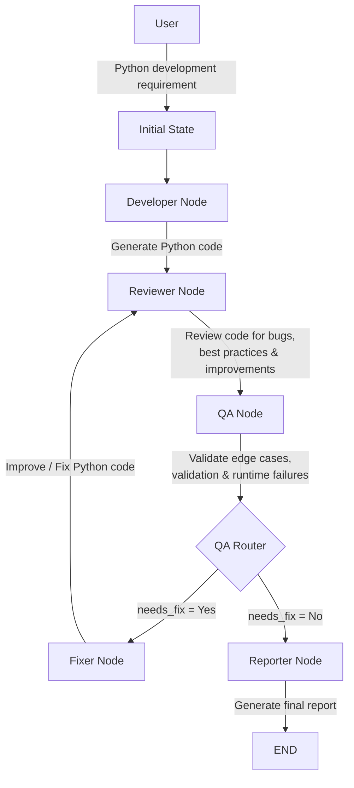

# LangGraph Developer Team

## Goal

Build an autonomous AI software development team that can **generate, review, validate, fix, and report on Python code** using a LangGraph-controlled workflow.

The system takes a Python development requirement from the user and passes it through specialized AI agents. Based on QA results, the workflow can either complete successfully or loop back to the fixer for another iteration.

---

## Workflow



### Workflow Explanation

1. **User** provides a Python development requirement.
2. **Developer Node** generates the initial Python implementation.
3. **Reviewer Node** reviews the generated code for:

   * Bugs
   * Best practices
   * Maintainability
   * Performance
   * Code quality
4. **QA Node** specifically validates:

   * Edge cases
   * Missing validation
   * Failure scenarios
   * Runtime issues
   * Incorrect assumptions
5. **QA Router** evaluates the QA result:

   * `needs_fix = Yes` → send the code to the **Fixer Node**
   * `needs_fix = No` → proceed to the **Reporter Node**
6. **Fixer Node** uses the requirement, review feedback, and QA feedback to generate an improved version of the code.
7. The improved code goes through the **Reviewer → QA** cycle again.
8. **Reporter Node** produces the final quality report containing:

   * Code quality
   * Improvements made
   * Remaining risks
   * Final recommendation
9. The workflow reaches **END**.

---

## Nodes

The workflow consists of the following nodes:

| Node          | Responsibility                                                                             |
| ------------- | ------------------------------------------------------------------------------------------ |
| **Developer** | Generates Python code from the user requirement                                            |
| **Reviewer**  | Reviews code for bugs, best practices, maintainability, and optimization                   |
| **QA**        | Validates edge cases, input validation, failure scenarios, assumptions, and runtime issues |
| **Fixer**     | Fixes issues identified by the Reviewer and QA agents                                      |
| **Reporter**  | Generates the final implementation quality report                                          |
| **Router**    | Determines whether the code needs another fix iteration                                    |

---

## Agent Responsibilities

### 1. Developer Agent

Takes the user requirement and generates complete Python code.

```text
Requirement
    ↓
Developer Agent
    ↓
Generated Python Code
```

The generated code should handle:

* Normal execution paths
* Edge cases
* Input validation
* Exceptions
* Python best practices
* Maintainability
* Correct syntax

---

### 2. Reviewer Agent

Reviews the generated implementation against the original requirement.

The reviewer checks:

* Functional correctness
* Missing requirements
* Logical bugs
* Error handling
* Security concerns
* Performance
* Code quality
* PEP 8
* Maintainability
* Unnecessary complexity

The reviewer produces structured feedback for the fixer.

---

### 3. QA Agent

The QA agent focuses specifically on scenarios that could cause the implementation to fail.

It checks:

* Boundary conditions
* Invalid inputs
* Empty/null inputs
* Unexpected data types
* Missing validation
* Failure scenarios
* Runtime errors
* Unhandled exceptions
* Incorrect assumptions
* Missing functionality
* Resource/state-related issues

The QA agent produces only:

```text
needs_fix = Yes
```

or:

```text
needs_fix = No
```

---

### 4. Fixer Agent

The fixer receives:

```text
Requirement
+
Generated Code
+
Review Feedback
+
QA Feedback
```

and produces an improved version of the Python code.

The fixer must:

* Resolve identified issues
* Preserve correct functionality
* Handle identified edge cases
* Add missing validation
* Prevent regressions
* Maintain clean Python code

---

### 5. Reporter Agent

The reporter generates a concise final report covering:

* **Quality**
* **Improvements Made**
* **Remaining Risks**
* **Final Recommendation**

The report summarizes the final state of the implementation after the review and QA process.

---

### 6. Router

The router controls the iterative workflow.

```text
                 ┌── needs_fix = Yes ──→ Fixer
                 │                         │
Developer → Reviewer → QA → Router ────────┘
                          │
                          └── needs_fix = No → Reporter → END
```

This allows the system to automatically iterate through **review → QA → fix** until the QA agent determines that no further fixes are required.

---

## State

The LangGraph workflow maintains the following state:

```python
{
    "requirement": "",
    "generated_code": "",
    "review_feedback": "",
    "qa_feedback": "",
    "final_report": "",
    "needs_fix": False,
    "iteration_count": 0,
}
```

### State Fields

| Field             | Description                        |
| ----------------- | ---------------------------------- |
| `requirement`     | Original user requirement          |
| `generated_code`  | Current Python implementation      |
| `review_feedback` | Feedback generated by the Reviewer |
| `qa_feedback`     | QA validation result               |
| `final_report`    | Final implementation report        |
| `needs_fix`       | Controls the workflow routing      |
| `iteration_count` | Tracks fix iterations              |

---

## Architecture

```text
User Requirement
       │
       ▼
┌──────────────┐
│   Developer  │
└──────┬───────┘
       │
       ▼
┌──────────────┐
│   Reviewer   │
└──────┬───────┘
       │
       ▼
┌──────────────┐
│      QA      │
└──────┬───────┘
       │
       ▼
┌──────────────┐
│    Router    │
└───┬──────┬───┘
    │      │
   Yes     No
    │      │
    ▼      ▼
┌───────┐ ┌──────────┐
│ Fixer │ │ Reporter │
└───┬───┘ └────┬─────┘
    │          │
    └──→ QA    ▼
            END
```

---

## Key Characteristics

* **Autonomous development workflow**
* **Multi-agent architecture**
* **Iterative code improvement**
* **Requirement-driven development**
* **Automated code review**
* **Dedicated QA validation**
* **Conditional workflow routing**
* **Automated final reporting**
* **LangGraph-based orchestration**

---

## Project Structure

A typical project structure is:

```text
langgraph-software-dev-agent/
│
├── app/
│   ├── __init__.py
│   ├── graph.py
│   └── nodes.py
│
├── main.py
├── requirements.txt
├── .env
└── README.md
```

---

## Execution

Run the application with:

```bash
python main.py
```

Enter a Python development requirement when prompted.

To stop the application:

```text
exit
```

---

## Example

### Input

```text
Create a Python function that reads a CSV file and returns
the average value of a specified numeric column.
```

### Workflow

```text
Requirement
     ↓
Developer
     ↓
Python Code
     ↓
Reviewer
     ↓
QA
     ↓
needs_fix = Yes
     ↓
Fixer
     ↓
Reviewer
     ↓
QA
     ↓
needs_fix = No
     ↓
Reporter
     ↓
Final Report
```

---

## Tech Stack

* Python
* LangGraph
* LangChain
* Groq
* LLM-based developer/reviewer/QA/fixer/reporter agents

---

## Author

**Ankit Mirajkar**

GitHub: [Ankitmirajkar1](https://github.com/Ankitmirajkar1)
